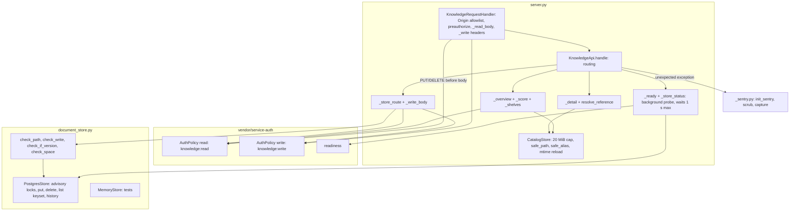

# 07 — C4 Component

```mermaid
flowchart TB
  subgraph HTTP["server.py"]
    H["KnowledgeRequestHandler: Origin allowlist, preauthorize, _read_body, _write headers"]
    API["KnowledgeApi.handle: routing"]
    RDY["_ready + _store_status: background probe, waits 1 s max"]
    OV["_overview + _score + _shelves"]
    DT["_detail + resolve_reference"]
    SR["_store_route + _write_body"]
    CS["CatalogStore: 20 MiB cap, safe_path, safe_alias, mtime reload"]
  end
  subgraph AUTH["vendor/service-auth"]
    AP["AuthPolicy read: knowledge:read"]
    WP["AuthPolicy write: knowledge:write"]
    RD["readiness"]
  end
  subgraph STORE["document_store.py"]
    CHK["check_path, check_write, check_if_version, check_space"]
    PG["PostgresStore: advisory locks, put, delete, list keyset, history"]
    MEM["MemoryStore: tests"]
  end
  SEN["_sentry.py: init_sentry, scrub, capture"]

  H --> API
  H -->|"PUT/DELETE before body"| AP
  H --> WP
  API --> RDY
  RDY --> RD
  RDY --> PG
  API --> OV
  API --> DT
  API --> SR
  OV --> CS
  DT --> CS
  OV --> AP
  SR --> AP
  SR --> WP
  SR --> CHK
  CHK --> PG
  API -->|"unexpected exception"| SEN
```

Sources: `server.py`, `document_store.py`, `vendor/service-auth/service_auth/__init__.py`, `_sentry.py`

## Open questions

- ไม่มี
